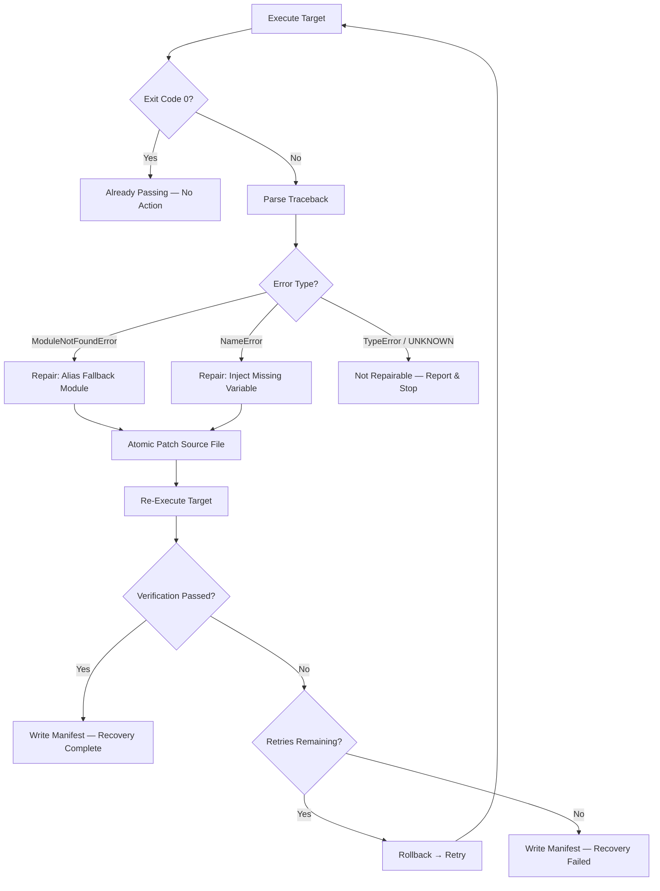

<div align="center">

# BugBay

### Autonomous Runtime Recovery Engine for Python

**Detect. Diagnose. Repair. Verify. All without human intervention.**

---

[**View on Rote Play**](https://play.modiqo.ai/bugbay/bugbay-runtime-recovery@0.0.3) · [Quick Start](#quick-start) · [Architecture](#architecture) · [How It Works](#the-recovery-loop) · [Proof](#recovery-evidence-chain)

</div>

---

## The Problem

Runtime failures — missing modules, undefined variables, broken imports — kill Python processes in production, CI pipelines, and development environments. Engineers wake up, read a traceback, identify the root cause, patch the file, and re-run. **BugBay automates the entire cycle**: it captures the live failure, diagnoses the error class, applies a bounded deterministic repair, and independently verifies the fix — closing the loop without a human touching the keyboard.

---

## Why BugBay Is Not Another Error Monitor

| Traditional Tools | BugBay |
|---|---|
| Detect and alert | Detect **and repair** |
| Log the traceback | Diagnose the error class and target |
| Require a human to fix | Apply a bounded deterministic patch |
| Trust that the alert was enough | **Independently re-run and verify** the fix |
| No rollback safety | **Atomic writes + automatic rollback** on failure |

BugBay closes the feedback loop. It does not just tell you something broke — it fixes it and proves the fix works.

---

## The Recovery Loop

```
REAL RUNTIME FAILURE
       │
       ▼
   ┌─────────┐
   │ DETECT  │  Execute the target Python file as a subprocess
   └────┬────┘
        ▼
   ┌─────────┐
   │ CAPTURE │  Capture exit code, stdout, stderr, duration
   └────┬────┘
        ▼
   ┌──────────┐
   │ DIAGNOSE │  Parse traceback → error class, source file, line number
   └────┬─────┘
        ▼
   ┌──────────┐
   │ CLASSIFY │  Is this error in the repairable set? (ModuleNotFoundError, NameError)
   └────┬─────┘
        ▼
   ┌─────────┐
   │ REPAIR  │  Atomic patch: swap import or inject missing variable
   └────┬────┘
        ▼
   ┌─────────┐
   │ RE-RUN  │  Execute the target again from scratch
   └────┬────┘
        ▼
   ┌──────────┐
   │ VERIFY   │  Independent verification — BugBay never claims success without it
   └────┬─────┘
        ▼
   ┌──────────┐
   │ RECOVER  │  Success → write evidence manifest → done
   └────┬─────┘
        │ (if verification fails)
        ▼
   ┌──────────┐
   │ ROLLBACK │  Atomic restore of original file → bounded retry
   └──────────┘
```

Every step is logged. Every repair is reversible. Every success is verified.

---

## Architecture

```
bugbay/
├── __main__.py        CLI entry point — parses args, invokes orchestrator
├── orchestrator.py    Central recovery loop — the brain
├── interceptor.py     Subprocess runner — captures runtime results
├── diagnosis.py       Traceback parser — classifies error, extracts targets
├── repair.py          Deterministic patcher — atomic writes + rollback
├── verifier.py        Independent post-repair verification
└── manifest.py        JSON evidence chain writer
```

### Component Responsibilities

| Component | Role |
|---|---|
| **`interceptor`** | Runs the target Python file as a subprocess. Returns a `RuntimeResult` with `exit_code`, `stdout`, `stderr`, and `duration_seconds`. No judgment — pure capture. |
| **`diagnosis`** | Parses stderr using regex patterns. Identifies error type (`ModuleNotFoundError`, `NameError`, `TypeError`, or `UNKNOWN`), extracts the missing module/variable name, source file path, and crash line number. Returns a structured `Diagnosis`. |
| **`repair`** | Applies deterministic, bounded repairs. For `ModuleNotFoundError`: rewrites the import line to alias a controlled fallback module. For `NameError`: prepends an explicit variable definition. Uses atomic writes (temp file + `os.replace`). Saves original content for rollback. |
| **`verifier`** | Re-runs the target from scratch. Returns a `VerificationResult`. This is a clean, independent execution — not a cache of previous results. |
| **`orchestrator`** | Drives the full loop: detect → diagnose → repair → re-run → verify. If verification fails, rolls back and retries within the bounded limit. Writes the diagnostic manifest. |
| **`manifest`** | Generates a structured JSON manifest containing the full evidence chain: before state, diagnosis, repair applied, post-repair verification, and after state. |

---

## The Autonomous Decision Flow



---

## Supported Deterministic Repair Classes

### Actually Implemented

| Error Class | Repair Strategy | Safety Checks |
|---|---|---|
| **`ModuleNotFoundError`** | Rewrites `import <missing>` → `import <fallback> as <missing>` using a controlled replacement module (`bugbay_dependency_fallback`) | Source must be within project boundary; diagnosed line must exactly match expected import; atomic write with rollback |
| **`NameError`** | Prepends `variable_name = <replacement_value>` to the top of the source file | Source must be within project boundary; variable name extracted from traceback; atomic write with rollback |

### Not Implemented (Deliberate Boundary)

| Error Class | Status |
|---|---|
| `TypeError` | Diagnosed but **not repaired** — reported as non-repairable |
| `RuntimeError` | Diagnosed but **not repaired** — reported as non-repairable |
| `SyntaxError` | Not attempted — too dangerous for automated patching |
| Logic errors | Not attempted — requires semantic understanding |

BugBay is intentionally narrow. It repairs what it can prove is safe and refuses what it cannot.

---

## Safety Boundaries & Bounded Recovery

### Project Boundary Enforcement

```python
def is_safe_source_path(source_file: str, project_root: Path) -> bool:
    """Reject any repair targeting files outside the project tree."""
```

BugBay will **never** patch a file outside the project directory. If the diagnosed source path resolves outside the project root, the repair is refused.

### Content Validation Before Patching

Before modifying any file, BugBay verifies:
1. The diagnosed source file exists on disk
2. The diagnosed line number is within the file's line count
3. The line at the crash point contains the **exact** expected pattern (`import <missing_module>`)
4. The pattern appears in the file content

If any check fails, the repair is rejected with a clear reason — no partial patches.

### Atomic Writes

All file modifications use atomic writes:

```python
def atomic_write_text(path: Path, content: str) -> None:
    with tempfile.NamedTemporaryFile(...) as temporary:
        temporary.write(content)
    os.replace(temporary_path, path)  # Atomic on POSIX and Windows
```

If the write fails midway, the original file is untouched. No corrupted state.

### Automatic Rollback

Every `RepairResult` stores `original_content`. If post-repair verification fails:

```python
def rollback_repair(repair: RepairResult) -> bool:
    atomic_write_text(source_path, repair.original_content)
```

The file is restored to its exact pre-patch state. The system never leaves behind a half-applied fix.

### Bounded Retry

The `max_retries` parameter (default: 1) caps recovery attempts. The orchestrator loops:
- Execute → Fail → Diagnose → Repair → Verify
- If verification fails → Rollback → Re-execute → Retry

After `max_retries` attempts, BugBay stops, writes a failure manifest, and exits with code 1. It does not spiral.

---

## Recovery Evidence Chain

Every recovery run produces a structured JSON manifest in `manifests/diagnostic-manifest.json`:

```
BEFORE          →  FAILURE         →  DIAGNOSIS      →  REPAIR
exit_code: 1       error_type:        applied: true      description: "Defined
stdout: ""          NameError          source_file:        missing variable
stderr: <traceback> missing_variable:  ".../target.py"    'database_connection'"
passed: false       "database_        original_content:   with explicit value"
                    connection"       <full original>
                    repairable: true

         →  RE-EXECUTION        →  VERIFICATION     →  AFTER
         exit_code: 0               passed: true         exit_code: 0
         stdout: <output>           exit_code: 0         stdout: <output>
         stderr: ""                 stderr: ""           stderr: ""
                                    duration_seconds:    passed: true
                                    <time>
                                    rollback: false
```

This is a **cryptographically timestamped audit trail** of the entire autonomous recovery — not just a log line.

### Real Manifest Evidence

From the verified `manifests/diagnostic-manifest.json` after a `retry_failure.py` recovery:

```json
{
  "schema_version": "1.0",
  "diagnosis": {
    "error_type": "NameError",
    "missing_variable": "database_connection",
    "repairable": true
  },
  "repair": {
    "applied": true,
    "description": "Defined missing variable 'database_connection' with an explicit controlled value."
  },
  "verification": {
    "passed": true,
    "exit_code": 0,
    "stdout": "Retry recovery succeeded\n",
    "before": { "passed": false, "exit_code": 1 },
    "after": { "passed": true, "exit_code": 0 },
    "rollback": { "applied": true }
  }
}
```

The manifest captures the **before**, the **failure**, the **diagnosis**, the **repair**, the **verification**, and the **after** — a complete evidence chain.

---

## 8-Phase SVG SRE Command Center

The Rote Play presentation visualizes BugBay's recovery loop as an 8-phase SRE Command Center:

| Phase | What Judges See |
|---|---|
| 1. Runtime Interception | The target process being captured |
| 2. Failure Detection | Exit code ≠ 0, stderr captured |
| 3. Traceback Diagnosis | Error type, source file, line number parsed |
| 4. Repair Classification | Deterministic repair strategy selected |
| 5. Atomic Patching | Source file modified with safety validation |
| 6. Post-Repair Verification | Target re-executed from scratch |
| 7. Evidence Manifest | JSON audit trail written |
| 8. Recovery Status | Final pass/fail with full trace |

**[See it live on Rote Play](https://play.modiqo.ai/bugbay/bugbay-runtime-recovery@0.0.3)**

---

## Test Suite & Verified Results

```
17 tests collected · 15 pass · 2 platform-specific (Windows path assertions)
```

| Test File | Tests | What It Proves |
|---|---|---|
| `test_interceptor.py` | 1 | Subprocess capture works — captures exit code, stderr, timing |
| `test_diagnosis.py` | 3 | Traceback parsing — ModuleNotFoundError, NameError, TypeError, UNKNOWN, multi-frame tracebacks |
| `test_dependency_repair.py` | 1 | `import missing` → `import fallback as missing` rewrite is correct |
| `test_missing_variable_repair.py` | 2 | Variable injection prepends the correct value; rollback restores original |
| `test_repair_safety.py` | 2 | Rejects files outside project boundary; rejects unexpected source content |
| `test_rollback.py` | 1 | Atomic rollback restores exact original content |
| `test_bounded_retry.py` | 5 | Bounded retry stops at limit; orchestrator retries and recovers; manifest is written on success and failure |
| `test_cli.py` | 2 | CLI requires target argument; CLI runs and reports SUCCESS |

### Verified ModuleNotFoundError Recovery

The `fixtures/dependency_failure.py` triggers:

```
ModuleNotFoundError: No module named 'nonexistent_bugbay_dependency'
```

BugBay diagnoses the error, rewrites the import to `import bugbay_dependency_fallback as nonexistent_bugbay_dependency`, re-runs the target, and the application starts successfully.

---

## Quick Start

### Prerequisites

- Python 3.10+
- No external dependencies required (stdlib only)

### Run the Recovery Engine

```bash
# Run against the intentional dependency failure fixture
python -m bugbay fixtures/dependency_failure.py

# Run against the missing variable failure fixture
python -m bugbay fixtures/missing_variable_failure.py

# Run with bounded retries
python -m bugbay fixtures/retry_failure.py --max-retries 3
```

### Run the Test Suite

```bash
pytest -v
```

### Run the Demo

```bash
# Before: target fails with ModuleNotFoundError
python fixtures/dependency_failure.py
# → ModuleNotFoundError: No module named 'nonexistent_bugbay_dependency'

# Run BugBay recovery
python -m bugbay fixtures/dependency_failure.py
# → BugBay runtime recovery starting...
# → RECOVERY ATTEMPT: 1
# → ERROR TYPE: ModuleNotFoundError
# → MISSING MODULE: nonexistent_bugbay_dependency
# → REPAIR APPLIED: True
# → VERIFICATION PASSED: True
# → BUGBAY RESULT: SUCCESS

# After: target runs successfully
python fixtures/dependency_failure.py
# → Application started
```

---

## Demonstration: Intentional Dependency Failure

### The Fixture

```python
# fixtures/dependency_failure.py
import nonexistent_bugbay_dependency
print("Application started")
```

This script imports a module that does not exist. Running it crashes immediately.

### What BugBay Does

| Step | Action | Result |
|---|---|---|
| 1. Intercept | Execute `dependency_failure.py` | `exit_code: 1`, `ModuleNotFoundError` |
| 2. Diagnose | Parse traceback | `missing_module: nonexistent_bugbay_dependency`, line 1 |
| 3. Validate | Check source path, line content | Safe — within project, line matches `import nonexistent_bugbay_dependency` |
| 4. Repair | Atomic patch | `import nonexistent_bugbay_dependency` → `import bugbay_dependency_fallback as nonexistent_bugbay_dependency` |
| 5. Verify | Re-execute `dependency_failure.py` | `exit_code: 0`, `Application started` |
| 6. Manifest | Write evidence JSON | Full audit trail with before/after states |

The application runs. The dependency was swapped with a controlled fallback module (`bugbay_dependency_fallback`). The fix is real, verified, and reversible.

---

## Bounded Retry + Rollback Behavior

BugBay's retry mechanism is designed for **transient failures** — situations where the first repair attempt might not survive verification (e.g., the target has state-dependent logic).

### How It Works

```
Attempt 1: Execute → Fail → Diagnose → Repair → Verify
                                                 │
                                         ┌───────┴───────┐
                                         │ PASS?         │
                                         │ YES → Done    │
                                         │ NO ↓          │
                                         └───────┬───────┘
                                                 │
                                         Rollback repair
                                                 │
                                         Re-execute target
                                                 │
Attempt 2: Execute → Fail → Diagnose → Repair → Verify
                                                 │
                                         ┌───────┴───────┐
                                         │ PASS?         │
                                         │ YES → Done    │
                                         │ NO ↓          │
                                         └───────┬───────┘
                                                 │
                                     Retries exhausted → FAILURE
```

### Verified Behavior

- **`test_orchestrator_retries_and_recovers`**: With `max_retries=3`, the orchestrator retries through a transient verification failure and succeeds on attempt 3
- **`test_orchestrator_stops_at_retry_limit`**: With `max_retries=2` against a `permanent_failure.py`, the orchestrator stops after 2 attempts and returns `False`
- **`test_non_repairable_failure_writes_manifest`**: Even on failure, a manifest is written with `repairable: false` — the evidence is always preserved

---

## Why This Matters for SRE

SRE teams spend significant time on **repeatable, well-understood failures**: missing environment variables, uninstalled dependencies, configuration drift. These failures have deterministic root causes and deterministic fixes.

BugBay proves that a **closed-loop autonomous recovery system** can:

1. **Detect** — Capture the exact failure from a live process
2. **Diagnose** — Classify the error and extract actionable information
3. **Repair** — Apply a bounded, deterministic patch with safety checks
4. **Verify** — Independently confirm the fix works
5. **Rollback** — Automatically undo if the fix fails
6. **Audit** — Produce a complete evidence chain

This is not a monitoring tool. This is not an alerting system. This is **autonomous runtime self-healing** with a verifiable audit trail.

---

## Limitations & Safety

BugBay is deliberately constrained:

| Limitation | Why |
|---|---|
| **Only repairs `ModuleNotFoundError` and `NameError`** | These have deterministic, pattern-based fixes. Other error classes require semantic understanding. |
| **No AI/LLM-based code generation** | All repairs are template-based and provably safe. No generated code enters the system. |
| **No external network calls** | All operations are local. No telemetry, no cloud dependencies. |
| **No production deployment features** | This is a proof of concept, not a production service. |
| **Bounded retries only** | BugBay does not attempt infinite recovery — it stops at the configured limit. |
| **Project-scoped only** | Repairs are restricted to files within the project tree. |

BugBay does not claim to be a general-purpose autonomous repair system. It is a **focused demonstration** of closed-loop recovery for a narrow, well-defined class of Python runtime failures.

---

## For Hackathon Judges

### What BugBay Demonstrates

**Closed-loop autonomous runtime recovery** — a system that detects a real failure, diagnoses the root cause, applies a safe repair, verifies the fix, and rolls back if it fails, all without human intervention.

### Key Engineering Achievements

1. **Full autonomous loop**: Failure → Detection → Diagnosis → Repair → Verification → Recovery — not just detection, not just alerting, but **complete recovery with proof**
2. **Deterministic safety**: Every repair is bounded, validated, atomic, and reversible. BugBay will never leave a corrupted file.
3. **Independent verification**: BugBay does not trust its own repair — it re-runs the target from scratch and checks the exit code. No false positives.
4. **Evidence chain**: The diagnostic manifest is a structured, timestamped audit trail that proves exactly what happened, before and after.
5. **Narrow by design**: BugBay does not pretend to solve all runtime failures. It solves exactly what it can prove is safe and stops there.

### The Distinction

Most "self-healing" systems detect and restart. BugBay **diagnoses and repairs**. The difference is the gap between "something is broken" and "here is exactly what is broken, here is exactly how I fixed it, and here is proof it works now."

### Play It Live

**[BugBay on Rote Play](https://play.modiqo.ai/bugbay/bugbay-runtime-recovery@0.0.3)**

---

<div align="center">

**BugBay** — Because the best error is the one that fixes itself.

</div>
